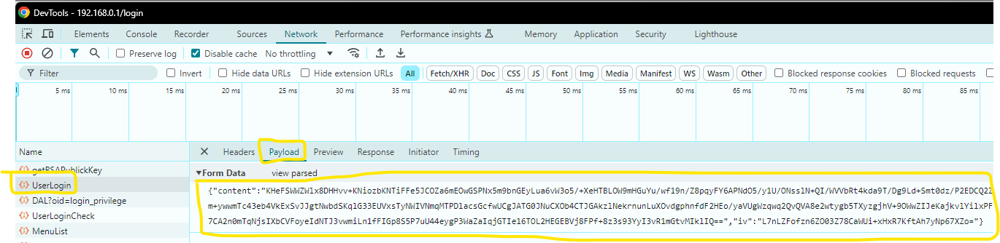
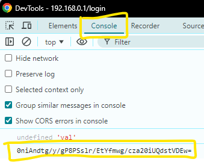

# Introduzione
Questo Custom Component di Home Assistant permette di recuperare le informazioni relative al modem router <code>ZyXEL LTE5398-M904</code> e le espone ad Home Assistant

# Funzionamento
Il componente:
- si connette allo ZyXEL, 
- esegue il login, 
- recupera periodicamente le informazioni sfruttando delle opportune chiamate alle interfacce web-based offerte dallo ZyXEL

# Configurazione
È necessario conoscere i seguenti dati dello ZyXEL:
- Indirizzo IP
- Username
- Password

In base ai dati precedenti, si possono recuperare le seguenti informazioni:
- <code>content</code>, <code>key</code> e <code>iv</code> inviati in fase di Login
- <code>aes_key</code> utilizzato dallo ZyXEL per cifrare i dati

Per recuperare <code>content</code>, <code>key</code> e <code>iv</code> inviati in fase di Login è necessario: 
- Collegarsi al modem router con un browser (ad es., Chrome)**
- Attivare l'ispezione del codice
- Inserire Username e Password ed effettuare il login
- Nella sezione di ispezione, selezionare la tab "Network" e cercare una elemento chiamato "UserLogin"
- Cliccare sull'elemento e aprire il tab "Payload"
- Cliccare su "view source"
- Copiare i dati inerenti a <code>content</code>, <code>key</code> e <code>iv</code>

Per recuperare <code>aes_key</code> dopo aver effettuato il login di cui ai punti precedenti: 
- Creare un link preferito nel browser
- Assegnare un nome al link e come valore della url incollare il seguente codice: 
<code>javascript:show_aes_key(); function show_aes_key(){ console.log(localStorage.AesKey); }</code>
- Dopo aver salvato il preferito, richiamarlo mentre si è nella pagina dello ZyXEL
- Se non già fatto, attivare l'ispezione del codice 
- Aprire il tab "Console"
- Copiare il codice che compare a schermo

